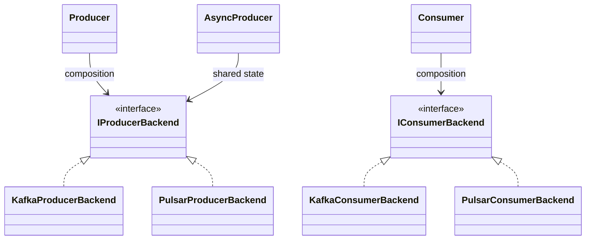

# C++ 消息队列 Bridge

## 为什么重构

原 Draft PR 已经用 `ProducerTransport` / `ConsumerTransport` 隔离了一部分 SDK，但对象创建、上层生命周期和 Kafka/Pulsar 具体实现仍绑定在同一组类型中，公共 `Message` 还保存 SDK handle。它更接近“一组 SDK Adapter”。本轮把稳定能力与后端实现显式拆成 Bridge：



- **Bridge**：`Producer`、`AsyncProducer`、`Consumer` 管理稳定 API、生命周期、callback 和消费线程。
- **Factory**：`create_producer_backend` / `create_consumer_backend` 只选择具体后端。
- **SDK Adapter**：Kafka/Pulsar `.cpp` 内部把 SDK message/error 转成领域模型，不暴露给调用方。
- **Builder**：当前配置尚不复杂，因此没有强行引入；未来只负责构造配置，不负责选择后端或执行消息操作。

C++ 使用带纯虚函数的抽象基类和组合，没有真实菱形继承，因此不使用虚继承。只有未来确实出现一个实现同时经两条继承路径共享同一基类状态时，才考虑 virtual inheritance。

## 公共领域模型

`domain.h` 定义 `Message`、`MessageHeaders`、`SendResult`、`HandlerResult`、`MQError`、`ErrorCode`、`ProducerConfig`、`ConsumerConfig`。公共 `Message` 只包含 topic、key、payload、headers、可选 partition、message id；SDK message 仅存在于 backend 私有 `Receipt` 中。

发送前输入是 topic/key/payload/headers/可选 partition；message id 和最终 partition 通常在 `SendResult` 中产生。`Message` 按值传递或由 Bridge 复制，payload/key 的所有权属于当前对象。callback 参数只保证在 callback 调用期间有效，需要保存时应复制结果。

后端不应向 Bridge 抛 SDK 异常；Bridge 仍防御性捕获所有异常并转换成 `MQError`。旧兼容 overload 会把统一错误包装为 `MQException`，不会暴露 SDK exception。

## Producer 与 AsyncProducer

Python 权威 API 的同步与异步发送共享一个 producer 和连接，因此 C++ 采用：

```cpp
auto backend = create_producer_backend(config);
Producer producer{std::move(backend)};
SendResult result = producer.send(message);

AsyncProducer async = producer.async(); // 共享 backend 与关闭状态
async.send_async(message, [](const SendResult& result) { /* ... */ });
```

`Producer` / `Consumer` 禁止复制，允许移动；析构函数 `noexcept` 并执行幂等关闭。每个被 backend 接受的异步请求最终只能调用一次 callback：Bridge 使用一次性 completion gate 抑制重复 callback，先释放 pending 计数，再调用用户 callback；callback 抛异常会被隔离。同步提交失败时返回 error 且不调用 callback。`close()` 拒绝新请求，等待同步发送，调用 backend close 以完成 SDK 队列，再等待所有已接受 callback 被派发。

backend 在 SDK 完成线程上收敛结果，再把用户 callback 派发到独立线程；调用方必须保证 callback 线程安全，不应假设它运行在调用线程。`close()` 等待 broker 完成和 callback 派发，但不等待 callback 内任意长的业务逻辑。

## Consumer 语义

`Consumer::start(handler)` 非阻塞，创建一个 Bridge 管理的 worker；同一 Consumer 的 handler 串行执行。重复 start 返回 `ErrorCode::AlreadyStarted`；`stop()` 幂等并允许之后重新 start；`close()` 隐含 stop、等待正在执行的 handler，然后关闭 backend。

handler 返回：

- `HandlerResult::acknowledge()`：手动 ack；
- `negative_acknowledge()`：nack；
- `leave_unacked()`：不处理；
- 返回带 error 的 result 或抛异常：Bridge 统一按 nack 处理。

Bridge 只保证单实例 handler 串行，不额外承诺跨 partition 顺序。partition 内顺序仍取决于 broker、订阅类型和 backend。关闭不会强杀正在执行的业务 handler。

## 配置与扩展

公共配置只保存 topic、订阅和 batching 等跨后端语义；`KafkaBackendConfig` 与 `PulsarBackendConfig` 分别保存后端专属字段。没有把所有 broker optional 字段塞入一个大结构。

新增后端：实现 `IProducerBackend` / `IConsumerBackend`，在后端文件中完成 SDK 转换，并在 `factory.cpp` 增加类型分支。新增上层能力：组合现有 backend 接口，无需为每个 broker 新增一组上层类型。

## 从拉取仓库开始验收

Fake Backend demo 不依赖 broker，只验证同步 Producer、异步 callback 和 Consumer start/handler/stop：

```bash
git clone https://github.com/mental1104/common.git
cd common
git fetch origin pull/42/head:pr-42
git switch pr-42

./dev setup-cpp --config Debug
./dev build-cpp --config Debug
./dev coverage-cpp

./cpp/build/bin/m1104_mq_bridge_demo
```

若生成器使用其他配置目录，可直接用 CMake：

```bash
cmake -S cpp -B cpp/build -DCMAKE_BUILD_TYPE=Debug -DCXX_STD=17
cmake --build cpp/build --target m1104_mq_bridge_demo test_mq
ctest --test-dir cpp/build -R test_mq --output-on-failure
./cpp/build/bin/m1104_mq_bridge_demo
```

预期输出：

```text
sync: sync-1
async callback: async-2
consumer: consumed
```

三行分别验证同步发送、异步 exactly-once callback、Consumer 非阻塞消费。真实 Kafka/Pulsar 验证还需要安装 native client 和可用 broker；仓库当前没有可复用的 MQ broker CI，本 PR 不声称真实 broker 集成通过。

## 兼容性

`KafkaMessageQueue` / `PulsarMessageQueue` 保留为兼容 Factory facade；`AbstractProducer` / `AbstractConsumer` 和 `ProducerTransport` / `ConsumerTransport` 保留别名。推荐新代码直接使用 `factory.h` 和 Bridge 类型。

旧 Draft PR 代码：

```cpp
auto producer = queue.create_producer("t", "n", "events");
producer->send(make_record("payload"));
```

新 API：

```cpp
auto kafka = std::make_shared<KafkaBackendConfig>();
kafka->options["bootstrap.servers"] = "127.0.0.1:9092";
ProducerConfig config;
config.topic.tenant = "t";
config.topic.namespace_name = "n";
config.topic.topic = "events";
config.backend = kafka;
Producer producer = create_producer(config);
Message message;
message.payload = make_record("payload");
SendResult result = producer.send(message);
```

Python API 与业务语义未修改。
