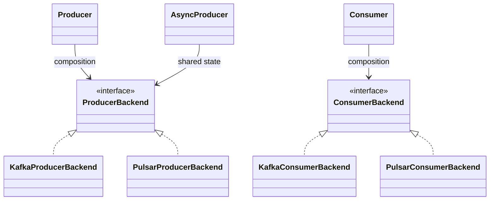

# Go 消息队列 Bridge

## 定位

本模块把两个变化维度拆开：

- **抽象维度**：`Producer`、共享同一连接的 `AsyncProducer`、`Consumer`；
- **实现维度**：`ProducerBackend`、`ConsumerBackend`，当前实现只有仓库已有的 Kafka 和 Pulsar。

Python `python/mental1104/mq` 仍是跨语言行为参考：同步和异步发送共享同一个 producer 生命周期，因此 Go 采用 `Producer.Async()` facade，而不是复制两套后端初始化逻辑。



Bridge 负责稳定 API、生命周期、callback 和消费循环；Factory 只负责根据类型安全配置创建 backend；Kafka/Pulsar 包内部的小接口只负责把第三方 SDK 转成领域模型。Builder 仅在未来配置构造复杂时使用，不承担 backend 选择或消息发送。

## 领域模型

`Message` 只包含 `Topic`、`Key`、`Payload`、`Headers`、`Partition`、`ID`，不暴露 SDK 消息对象。发送前由调用方提供 topic/key/payload/headers/可选 partition；`ID` 和实际 partition 通常由发送完成结果产生。

`NewMessage`、`CloneMessage` 和 backend 边界都会复制 `Key`、`Payload`、`Headers`。调用方可在方法返回后安全复用原切片；callback 收到的 `SendResult` 仅在 callback 执行期间由当前调用栈持有，需跨 goroutine 保存时自行复制业务数据。

错误统一为 `*MQError` 和 `ErrorCode`。`MQError.Unwrap` 保留 `errors.Is` / `errors.As` 对底层 cause 的判断能力，但公共 API 不返回 SDK 专属错误类型。

## Producer 与异步 callback

```go
backend, err := kafkamq.NewProducerBackend(config, kafkaConfig)
producer, err := mq.NewProducer(backend)
result, err := producer.Send(ctx, message)

async := producer.Async() // 共享 backend、连接和 Close 状态
err = async.SendAsync(ctx, message, func(result mq.SendResult) { /* ... */ })
```

语义：

- SDK 前的参数/编码失败或 backend 同步拒绝：`SendAsync` 返回 error，callback 不调用；
- backend 接受请求后：成功或失败最终只调用一次 callback；重复 backend callback 会被 `sync.Once` 丢弃；
- callback panic 被恢复，不破坏 SDK goroutine 或 Bridge 状态；
- `Close(ctx)` 拒绝新请求，等待同步发送、调用 backend close，再等待所有已接受异步请求完成；
- callback 可以调用同一个 producer 的 `Close`，因为完成计数会在进入用户 callback 前释放；
- callback 由 backend 调度到独立 goroutine，`Close` 等待 broker 完成和 callback 派发，但不等待 callback 内任意长的业务逻辑。

## Consumer 语义

`Start` 非阻塞并创建一个 Bridge 管理的 goroutine；同一 Consumer 的 handler 串行执行。重复 `Start` 返回 `ErrAlreadyStarted`。`Stop` 幂等，取消 receive、等待当前 handler 返回，之后允许再次 `Start`。`Close` 隐含 `Stop`、幂等，并关闭 backend。

handler 返回：

- `ConsumeAcknowledge`：手动 ack；
- `ConsumeNegativeAcknowledge`：nack；
- `ConsumeLeaveUnacknowledged`：不做处理；
- 返回 error 或 panic：记录 `ErrorHandler` 并 nack。

Bridge 不额外承诺跨 partition 顺序；单实例 handler 串行执行，具体 partition 内顺序仍取决于 broker、订阅类型和 backend。关闭会等待正在执行的 handler，不会强行中断业务函数。

## 配置与 Factory

公共配置：`mq.ProducerConfig` / `mq.ConsumerConfig`。后端配置保持独立：`kafka.Config`、`pulsar.Config`，不会形成包含全部 broker optional 字段的上帝结构。

```go
producer, err := factory.NewProducer(mq.ProducerConfig{
    Topic: mq.Topic{Tenant: "tenant", Namespace: "namespace", Name: "events"},
    Backend: kafka.Config{Brokers: []string{"127.0.0.1:9092"}},
})
```

新增后端：实现两个小 backend 接口，在独立包中完成 SDK 转换，再在 `factory` 增加一个类型分支。新增上层能力：组合已有 backend 接口，不需要产生 `KafkaXxx` / `PulsarXxx` 成对类型。

## 从拉取仓库开始验收

以下 demo 使用 Fake Backend，只验证 Bridge，不需要 broker，也没有新增生产环境 InMemory 后端。

```bash
git clone https://github.com/mental1104/common.git
cd common
git fetch origin pull/41/head:pr-41
git switch pr-41
cd golang

go test -race ./mental1104/mq/...
go vet ./mental1104/mq/...
go run ./mental1104/mq/examples/bridge_demo
```

预期输出：

```text
sync: sync-1
async callback: async-1
consumer: consumed
```

对应关系：第一行验证同步 Producer；第二行验证异步 callback；第三行验证非阻塞 Consumer start/handler/stop。

真实 Kafka/Pulsar 连接需要相应 broker。Factory 调用仍只返回公共 Bridge，业务代码不操作 SDK client。仓库当前没有本 PR 可复用的 MQ broker CI，因此真实 broker 集成测试未宣称通过。

## 兼容性与迁移

旧 PR 草稿中 `kafka.MessageQueue.CreateProducer` / `pulsar.MessageQueue.CreateProducer` 返回后端专属 Producer。桥接重构后推荐：

```go
// before
queue, _ := kafka.NewMessageQueue(kafka.Config{Brokers: brokers})
producer, _ := queue.CreateProducer(ctx, "t", "n", "events", nil, true)
_ = producer.Send(ctx, payload)

// after
producer, _ := factory.NewProducer(mq.ProducerConfig{
    Topic: mq.Topic{Tenant: "t", Namespace: "n", Name: "events"},
    Backend: kafka.Config{Brokers: brokers},
})
message, _ := mq.MessageFrom(payload)
_, _ = producer.Send(ctx, message)
```

这是本 Draft PR 尚未合并 API 的结构性调整；Python API 未修改。
